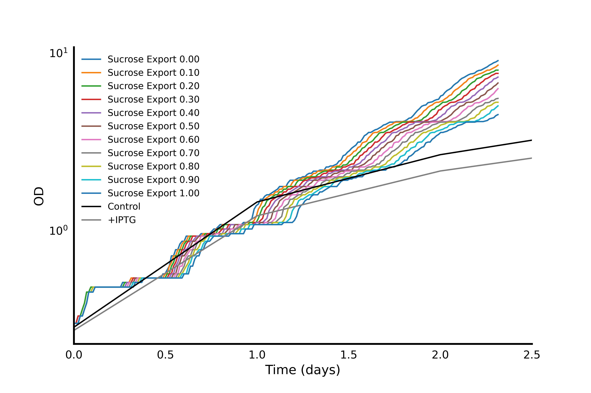
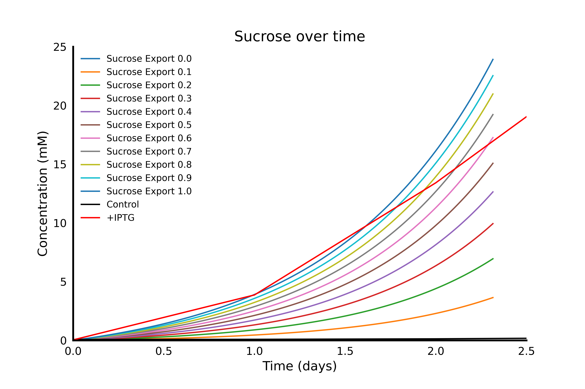
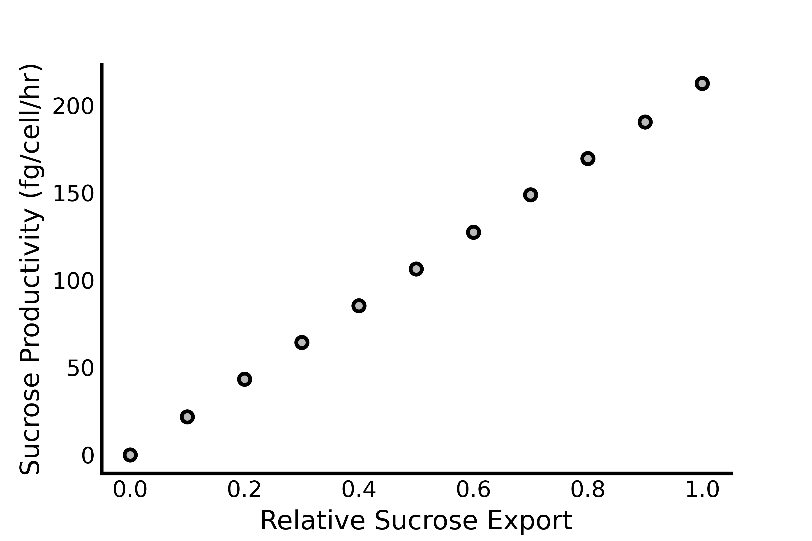
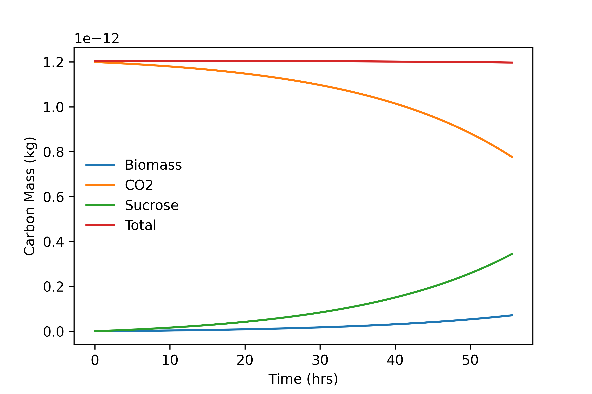
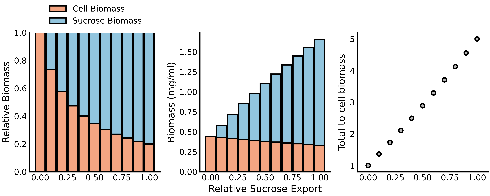

# NUFEB validation with axenic cyanobacteria culture
Simulated growth curve of <i>S. elongatus</i> with varying levels of sucrose export, ranging from 0 to 1. Control and +IPTG are experimental data without and with sucrose export, respectively.

</IMG>

 

Sucrose produced over time fits nicely to the experimental data bounds.

</IMG>

 

The productivity as a function of sucrose export varies linearly:

</IMG>

 

Mass conservation (e.g., sucrose export = 1)

</IMG>

 

Relative biomass production

</IMG>

 
